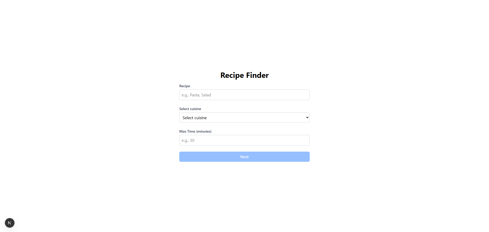
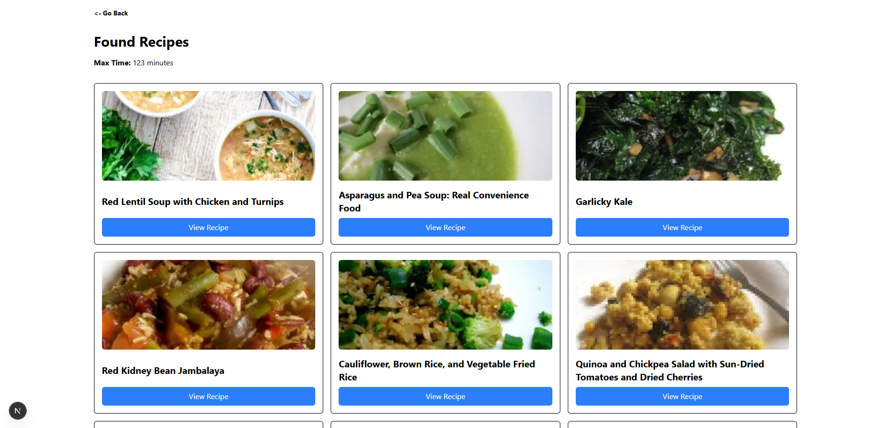
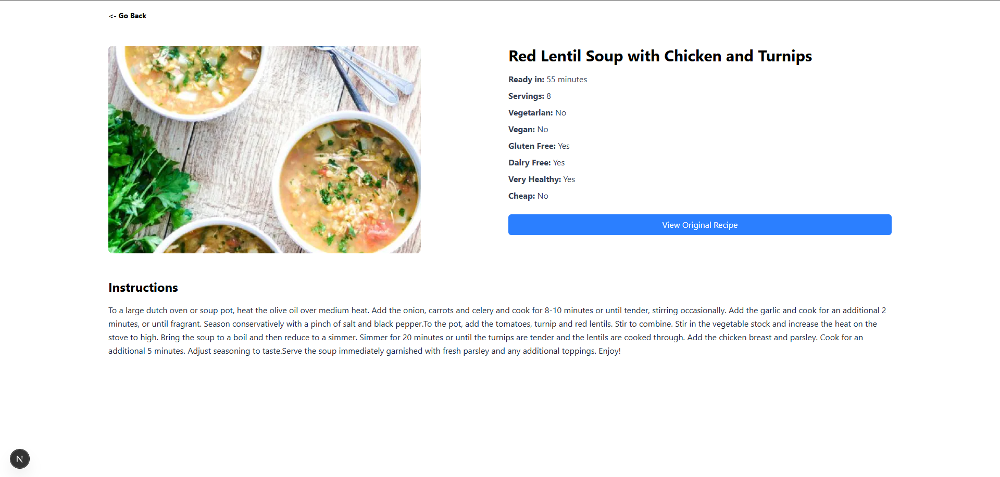

# 🍳 Recipes App

## 📜 Project Overview

This project is a web application that allows users to search and view detailed recipes. The application fetches data from an external API (Spoonacular) to provide recipes based on search queries like cuisine type, preparation time, and more.

## 🚀 Features

- **Recipe Search**: Users can search for recipes by keywords, cuisine, and maximum preparation time.
- **Recipe Details**: Each recipe includes a detailed page with information about ingredients, preparation time, servings, and more.
- **Pagination**: Recipe results are displayed in paginated format, allowing users to navigate through multiple pages of results.
- **Responsive Design**: The app is fully responsive, adapting to different screen sizes and devices.
- **Error Handling**: If a recipe cannot be fetched or doesn't exist, appropriate error handling is in place, directing users to a "Not Found" page.

---

## 🚀 Getting Started

### 1. Clone the repository

```bash
git clone https://github.com/your-username/your-repo-name.git
cd your-repo-name
```

### 2. Install dependencies

```bash
npm install
# or
yarn install
```

### 3. Set up environment variables

Create a `.env.local` file in the root of your project:

```bash
API_BASE_URL=https://api.spoonacular.com
SPOONACULAR_API_KEY=your-spoonacular-api-key
```

💡 You can get your API key from [Spoonacular API](https://spoonacular.com/food-api).

### 4. Run the development server

```bash
npm run dev
# or
yarn dev
```

### 📦 Building for Production

```bash
npm run build
npm start
```

## 🛠 Tech Stack

- **Next.js 14 (App Router)**
- **TypeScript**
- **TailwindCSS**
- **Spoonacular API**

## 📸 Screenshots

  
